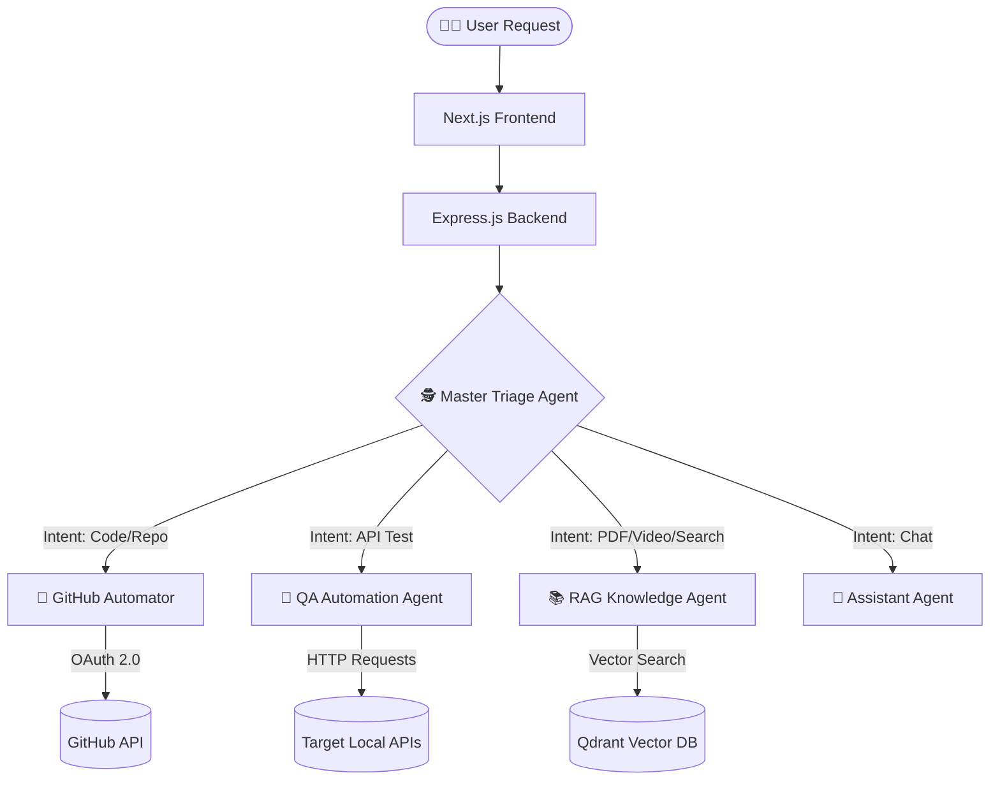

<div align="center">
  
  # 🧠 BrainDesk AI
  
  **A Unified, Multi-Agent AI Workspace for Developers**
  
  [](#)
  [](#)
  [](#)
  [](#)
  [](#)

</div>

<br/>

> **🚀 Watch the Demo:** https://drive.google.com/drive/folders/1lB6niRCVBwOLc1g-b2kFUTlATr2TpUH1?usp=sharing
## ⚡ The Engineering Challenge

While powerful AI developer tools exist in the market, **BrainDesk AI was built as an intensive engineering playground** to deeply understand Agentic Architecture, Vector Databases, and secure external tool integrations (OAuth). 

Instead of relying on a single, monolithic LLM prompt that gets easily confused, BrainDesk utilizes a **Multi-Agent Orchestration** pattern. It breaks down complex developer tasks into isolated, highly specialized agents working under a central router.

---

## 🏗️ High-Level System Architecture,

This flowchart represents the data flow of a user request. The **Triage Agent** acts as the gateway—it never answers queries directly. Instead, it analyzes the user's intent and autonomously routes the payload to the specific agent equipped with the right tools.



---

## 🧠 Core Engineering Decisions

### 1. Vector DB vs. NoSQL for Semantic Memory
Instead of storing user notes and PDF texts in MongoDB, BrainDesk utilizes **Qdrant Vector Database**. 
* **Why?** MongoDB excels at lexical (exact keyword) search, but fails at contextual meaning. By generating embeddings and using Qdrant's **HNSW (Hierarchical Navigable Small World)** algorithm, the RAG agent can perform Approximate Nearest Neighbor (ANN) searches. This allows the agent to retrieve exact historical context even if the user asks a vaguely worded question.

### 2. Preventing Orchestrator Crashes during Automated QA
When the QA Agent tests an API, it intentionally injects bad data to find edge cases. 
* **The Challenge:** Native HTTP clients throw exceptions on 4xx/5xx status codes, which would crash the Node.js backend.
* **The Solution:** I engineered a custom Axios wrapper bypassing default error throwing (`validateStatus: () => true`). This intercepts server crashes and passes the raw error payloads directly back to the Agent, allowing it to generate dynamic Markdown bug reports without breaking the server loop.

### 3. Hyper-Personalization using Mem0 (Long-Term AI Memory)
* **The Problem:** In traditional chatbots, if a user states their tech stack or API ports in session 1, session 2 forgets it completely unless it is manually re-entered. Passing heavy chat logs to the LLM every time wastes API credits and increases latency.
* **The Solution:** Whenever a message is sent, the controller calls `mem0.search()` to retrieve established facts mapped to that specific user ID. These extracted "User Facts" are injected as a context prompt directly into the Triage Agent. At the end of the execution loop, the system extracts new facts from the current conversation and saves them back to Mem0 permanently.


---

## 🤖 The Agent Ecosystem (Capabilities)

BrainDesk AI consists of 5 specialized agents. Each agent is equipped with specific tools and strict instructions to handle a dedicated domain.

### 1. 🕵️ Master Triage Agent (The Router)
* **Role:** The brain of the operation. It never answers user queries directly.
* **Mechanism:** It analyzes the user's prompt (and any attached file contexts) and strictly routes the payload to the appropriate sub-agent. It enforces safety by preventing cross-domain confusion (e.g., stopping the GitHub agent from trying to read a PDF).

### 2. 📚 RAG Knowledge Agent (Semantic Memory)
* **Role:** Handles document ingestion and semantic information retrieval.
* **Mechanism:** When a user uploads a PDF or provides a YouTube link, this agent (via the backend) extracts the text, chunks it, and stores the embeddings in **Qdrant**. When asked a question, it uses the `search_knowledge` tool to perform Approximate Nearest Neighbor (ANN) search, ensuring it answers *only* from the user's context, mitigating LLM hallucinations.

### 3. 🧪 QA Automation Agent (The Tester)
* **Role:** Intelligent, stateful API testing.
* **Mechanism:** Capable of hitting both local (`localhost`) and production APIs. It doesn't just ping endpoints; it:
  1. Deduces the required JSON schema based on the endpoint name.
  2. Generates randomized test data (to avoid database duplication errors).
  3. **Chains Requests:** Registers a user, saves the credentials in memory, and immediately tests the Login API using those exact credentials.
  4. Generates a highly professional Markdown Test Report, catching edge cases and backend crashes (500 errors).

### 4. 🐙 GitHub Automator Agent (The DevOps Engineer)
* **Role:** Directly interacts with the user's GitHub repositories.
* **Mechanism:** Integrated via GitHub OAuth 2.0. By using custom tools (`github_read_file`, `github_push_file`), it can autonomously create, update, or delete specific files in a repository. 
* **Safety Guardrail:** Hardcoded instructions completely restrict the agent from deleting entire repositories, ensuring destructive actions are blocked.

### 5. 💬 BrainDesk Assistant (The Fallback)
* **Role:** Standard conversational agent for general programming queries, debugging raw code snippets, and casual interactions when no specific tools are required.

---

## 💻 Tech Stack

* **Frontend:** Next.js (App Router), Tailwind CSS, Framer Motion
* **Backend:** Node.js, Express.js
* **Database:** MongoDB (User Data & Chat History)
* **Vector Database:** Qdrant (Embeddings & Semantic Search)
* **AI Models & Framework:** OpenAI (gpt-4o-mini, text-embedding-3-small)

---

## 🛠️ Getting Started (Local Setup)

### Prerequisites
* Node.js (v18+)
* MongoDB URI
* Qdrant Cluster URL & API Key
* OpenAI API Key
* GitHub OAuth App Credentials (Client ID & Secret)

### 1. Clone the repository
```bash
git clone [https://github.com/darvesh10/braindesk-ai.git](https://github.com/darvesh10/braindesk-ai.git)
cd braindesk-ai
```

### 2. Setup Backend
```bash
cd braindesk-backend
npm install
```
Create a `.env` file in the backend folder:
```env
PORT=5000
MONGODB_URI=your_mongodb_connection_string
JWT_SECRET=your_jwt_secret
OPENAI_API_KEY=your_openai_api_key
QDRANT_URL=your_qdrant_cluster_url
QDRANT_API_KEY=your_qdrant_api_key
GITHUB_CLIENT_ID=your_github_client_id
GITHUB_CLIENT_SECRET=your_github_client_secret
FRONTEND_URL=http://localhost:3000
```
Run the backend:
```bash
npm run dev
```

### 3. Setup Frontend
Open a new terminal window:
```bash
cd braindesk-frontend
npm install
```
Create a `.env.local` file in the frontend folder:
```env
NEXT_PUBLIC_BACKEND_URL=http://localhost:5000
```
Run the frontend:
```bash
npm run dev
```
Visit `http://localhost:3000` to start exploring BrainDesk AI.

---

## 🗺️ Future Roadmap
* **Mass Auto-API Testing:** Automatically extract routes from an uploaded backend file and execute tests dynamically.
* **Credit System:** Razorpay integration for tracking and limiting LLM usage.
* **Automated PR Reviewer:** Agent automatically reviews latest commits and finds bugs.

<div align="center">
  <i>Built with ❤️ for pushing the boundaries of AI integrations.</i>
</div>
